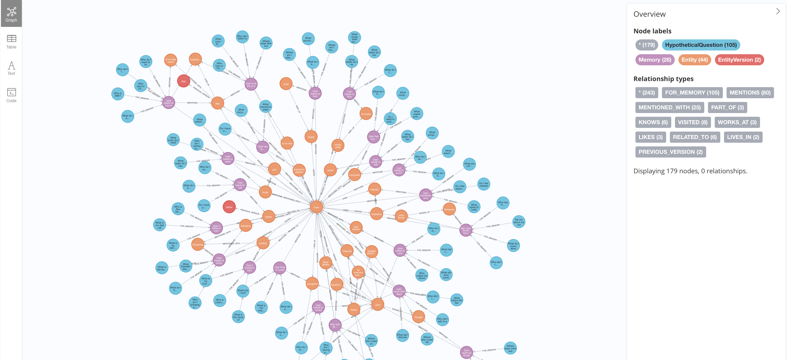

# BrainFreeze

Personal memory system using AI + graph database. Stores memories as a knowledge graph, extracts entities/relationships automatically, enables semantic + graph-based retrieval.



## Quickstart

```bash
docker compose up -d

cp .env.example .env
# Add secrets to the new file

bun run memory init

bun run memory import ./export-file.json
```

Now go to http://localhost:7475 and query it.  
Or go to the terminal and type `bun run memory chat` and have an interactive chat (see below for commands).  
Try things like: 

```
Meeting with abk soon, what do we know about him?
I already bought that beer for abk
What are my todos?
```

If you want to connect to it via MCP, add this configuration to the client:

```json
{
  "mcpServers": {
    "brainfreeze": {
      "command": "bun",
      "args": ["run", "mcp"],
      "cwd": "/path/to/brainfreeze",
      "env": {
        "NEO4J_URI": "bolt://localhost:7688",
        "NEO4J_USER": "neo4j",
        "NEO4J_PASSWORD": "password",
        "ANTHROPIC_API_KEY": "your-key",
        "OPENAI_API_KEY": "your-key"
      }
    }
  }
}
```

## Key Concepts

**Memory Types**
- `episodic` - events, experiences, conversations
- `semantic` - facts, knowledge
- `todo` - tasks, commitments
- `reflection` - thoughts, opinions

**Entities** - Named concepts (person, place, organization, concept) with:
- Properties (versioned - tracks history)
- Aliases (alternative names)
- Relationships to other entities

**Relationships** - KNOWS, WORKS_AT, LIVES_IN, VISITED, RELATED_TO, PART_OF, MENTIONED_WITH, LIKES, DISLIKES, PREFERS

**Hypothetical Questions** - Auto-generated questions that might retrieve a memory, stored with embeddings to improve recall.

## Lifecycle

### Storing a Memory

```
Input: "Had coffee with Sarah at Blue Bottle yesterday"
                    ↓
        MemoryAgent extracts:
        - entities: Sarah (person), Blue Bottle (place)
        - relationships: Sarah → VISITED → Blue Bottle
        - type: episodic
        - hypothetical questions
                    ↓
        MemoryAgent generates embeddings
                    ↓
        Neo4j stores:
        - Memory node (with embedding)
        - Entity nodes (normalized names)
        - Relationship edges
        - HypotheticalQuestion nodes
```

### Retrieving Memories

```
Query: "Where did I have coffee?"
                    ↓
        RetrieveAgent embeds query
                    ↓
        Hybrid search:
        - Vector similarity on memories + hypothetical questions
        - Graph expansion through shared entities
                    ↓
        RetrieveAgent synthesizes answer from relevant memories
```

### Entity Resolution

Ambiguous entities during storage prompt user selection or create new. `resolve` command finds similar entities and merges duplicates.

### Entity Versioning

Property updates create version snapshots linked in a chain, preserving history.

## Setup

```bash
bun install
cp .env.example .env  # configure NEO4J_*, ANTHROPIC_API_KEY, OPENAI_API_KEY
docker compose up -d
bun run memory init
```

## CLI Commands

```bash
bun run memory <text>              # Store a memory
bun run memory recall <query>      # Search memories (--vector-only, -l limit)
bun run memory answer <question>   # Synthesized answer (--vector-only, -l limit)
bun run memory chat                # Interactive chat session
bun run memory list                # List recent memories (-l limit)
bun run memory done <query> <summary>  # Mark todo as done
bun run memory merge <keep> <remove>   # Merge two entities
bun run memory resolve             # Find/merge duplicate entities
bun run memory export <file>       # Export memories to JSON
bun run memory import <file>       # Import memories from JSON
bun run memory init                # Initialize database schema
```

## Chat Commands

Inside `bun run memory chat`:

```
list                       List recent memories
recall <query>             Search memories
remember <text>            Store a new memory
done <query> | <summary>   Mark todo as done
merge <keep> <remove>      Merge two entities
help                       Show help
exit / quit                Exit chat
<anything else>            Ask a question (auto-detects intent)
```

Natural language also works: "mark call John done, I called him" or "show my todos".

## MCP Server

For Claude integration:

```bash
bun run mcp
```

### MCP Tools

| Tool | Description |
|------|-------------|
| `remember` | Store a memory/fact (`text`) |
| `answer` | Synthesized answer from memories (`question`, `limit?`, `vectorOnly?`) |
| `list_todos` | List all open/active todos |
| `done` | Mark todo as done (`todoQuery`, `resolutionSummary`) |
| `get_entity_history` | Get entity's current state and version history (`entityName`, `limit?`) |
| `merge_entities` | Merge two entities (`keepSearch`+`removeSearch` or `keepId`+`removeId`) |

### Claude Desktop Config

```json
{
  "mcpServers": {
    "brainfreeze": {
      "command": "bun",
      "args": ["run", "mcp"],
      "cwd": "/path/to/brainfreeze"
    }
  }
}
```

## Architecture

```
CLI/Chat/MCP Interface
        ↓
    MemorySystem (orchestration)
        ↓
┌──────────┼──────────┼──────────┐
│          │          │          │
IntentAgent MemoryAgent RetrieveAgent
(route)   (extract/store) (synthesize)
        ↓
┌───────┼───────┐
│       │       │
Neo4j  Vercel AI SDK
(graph) (Anthropic + OpenAI)
```

**Agents**:
- `IntentAgent` - Routes user input to correct operation (remember/recall/todo)
- `MemoryAgent` - Extracts entities, stores memories, manages todos
- `RetrieveAgent` - Searches and synthesizes answers from memories

## Tech Stack

- Bun + TypeScript
- Vercel AI SDK (agent framework)
- Neo4j (graph + vector indexes)
- Claude Sonnet 4.5 (extraction/synthesis via AI SDK)
- OpenAI text-embedding-3-small (embeddings via AI SDK)
- MCP protocol

## Testing

```bash
bun test
bun test --watch
```
